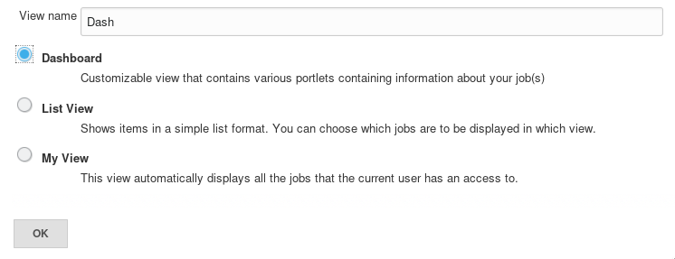
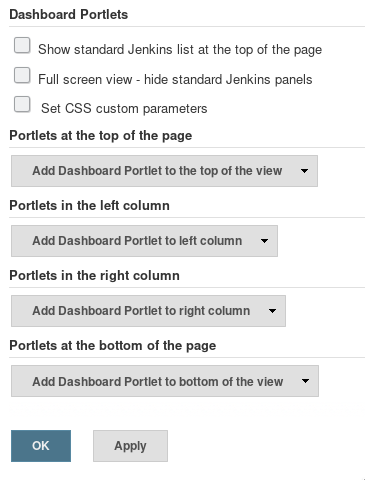

# Jenkins Dashboard View Plugin

[](https://plugins.jenkins.io/dashboard-view)
[](https://github.com/jenkinsci/dashboard-view-plugin/releases/latest)
[](https://plugins.jenkins.io/dashboard-view)

This plugin contributes a new view implementation that provides a dashboard /
portal-like view for your Jenkins instance.

## Add new view

On the Jenkins main page, click the + tab to start the new view wizard (If you
do not see a +, it is likely you do not have permission to create a new view). 
On the create new view page, give your view a name and select the Dashboard
type and click ok.



## Configure dashboard view

The configuration is done in 2 parts, selecting the Jenkins jobs to include in
the view, and selecting which dashboard portlets to have included in the view.
The jobs that you select are used for all the portlets to draw their
information from.



### Select jobs

Select the list of jobs to include in the dashboard. This is exactly the
same process as the standard list view that comes with Jenkins.

Also a regular expression can be used to specify the jobs to include in
the view.

### Options

- Show standard Jenkins list at the top of the page: shows uses standard
  Jenkins jobs list as it would be when using Jenkins' built-in 'List View'
  type.

### Select portlets

Configure which portlets you want to see on the top and on the left and the
right column. Each portlet may have its own configuration but at a minimum it
requires a name to be given to it.

Click ok and the dashboard configuration will be saved and you will be brought
to the dashboard view itself.

## View layout

The dashboard view supports a layout with rows spanning the entire view with 2
columns.

<table>
<tr><td colspan="2">Top portlet 1</td></tr>
<tr><td>Left portlet 1</td><td>Right portlet 1</td>
<tr><td>Left portlet 2</td><td>Right portlet 2</td>
<tr><td colspan="2">Bottom portlet 1</td></tr>
</table>

## Core portlets

The dashboard view comes with a number of portlets that you can configure your
view with (New portlets can be contributed to Jenkins via other plugins, even
your own).

### Standard Jenkins jobs list

This portlet shows a row for each job showing the standard columns
configured in Jenkins. All the configured portlets are displayed below
this list.

### Jobs Grid

The jobs grid portlet displays a 3 column table with the current status and a
clickable link to the job. This offers a more compressed presentation of your
jobs than the standard 1 row per job view, albeit at the cost of some job
information.

### Unstable Jobs

This portlet lists the unstable jobs within the view. Note, this does not
necessarily list all of Jenkins' unstable jobs, but only looks at jobs
configured for this view.

### Test Statistics Grid

The test statistics grid shows detailed test data for the configured jobs. 
This is useful to get an aggregated count of tests across the jobs in your
view. If desired, jobs with zero tests can be hidden.

### Test Statistics Chart

This is a pie chart of the tests in the configured jobs. It shows the passing,
failing, and skipped jobs with the total number and percentages.

### Test Trend Chart

This is a chart that shows your tests over time in aggregate. The logic is that
for every day since the first job in the view was built, it shows the total
number of passing, skipped and failing tests in aggregate across the build. It
assumes that if a build did not occur on a given day, that the previous day's
build results (or the previous-previous day, etc.) will be used.

### Jobs statistics

Shows statistics based on jobs health.

### Build statistics

Shows statistics based on build status.

## Contributing

If you want to contribute to this plugin, you probably will need a Jenkins
plugin developement environment. This basically means a current version of Java
(Java 8 should probably be okay for now) and [Apache Maven]. See the
[Jenkins Plugin Tutorial] for details.

If you have the proper environment, typing:

    $ mvn verify

should create a plugin as `target/*.hpi`, which you can install in your Jenkins
instance. Running

    $ mvn hpi:run -Djenkins.version=2.164.1

allows you to spin up a test Jenkins instance on [localhost] to test your
local changes before commiting.

[Apache Maven]: https://maven.apache.org/
[Jenkins Plugin Tutorial]: https://jenkins.io/doc/developer/tutorial/prepare/
[localhost]: http://localhost:8080/jenkins/

### Code Style

This plugin tries to migrate to [Google Java Code Style], please try to adhere
to that style whenever adding new files or making big changes to existing
files. If your IDE doesn't support this style, you can use the
[fmt-maven-plugin], like this:

    $ mvn fmt:format -DfilesNamePattern=ChangedFile\.java

to reformat Java code in the proper style.

[Google Java Code Style]: https://google.github.io/styleguide/javaguide.html
[fmt-maven-plugin]: https://github.com/coveo/fmt-maven-plugin

## Extending the Dashboard View plugin

Much of the benefit of this plugin will be realized when other plugins that
enhance Jenkins offer support for it.

Add support in your plugin:

- Extend the DashboardPortlet class and provide a descriptor that
  extends the `Descriptor<DashboardPortlet>`
- Create a jelly view called portlet.jelly
- Optionally create a jelly view called main.jelly to be used when the portlet
  is in maximized mode (otherwise the same portlet.jelly view will be used)

It is possible to define custom parameters for the DashboardPortlet. The
displayName is always required. To add new parameters:

- create a jelly file called config.jelly to be used when the portlet is
  configured (added to the view in 'Edit View' config page);
- modify constructor (with `@DataBoundConstructor`) to receive the new
  parameters.

Looking at the source code of this plugin will show a number of examples
of doing this. The core portlets do the same thing that your plugin
would do.

Please update the list below with a [pull request] against this repository.

Sample files:

**MyPortlet.java**:

```
import hudson.plugins.view.dashboard.DashboardPortlet;

class MyPortlet extends DashboardPortlet {

    @DataBoundConstructor
    public MyPortlet(String name) {
        super(name);
    }

// do whatever you want

    @Extension
    public static class DescriptorImpl extends Descriptor<DashboardPortlet> {
        @Override
        public String getDisplayName() {
            return "MyPortlet";
        }
    }
};
```

**portlet.jelly**:

```
<j:jelly xmlns:j="jelly:core" xmlns:st="jelly:stapler" xmlns:d="jelly:define"
  xmlns:dp="/hudson/plugins/view/dashboard" xmlns:l="/lib/layout"
  xmlns:t="/lib/hudson" xmlns:f="/lib/form">

  <dp:decorate portlet="${it}"> <!-- This is to say that this is a dashboard view portlet -->
    <tr><td> <!-- This is needed because everything is formatted as a table - ugly, I know -->

      <!-- you can include a separate file with the logic to display your data or you can write here directly -->
      <div align="center">
        <st:include page="myportlet.jelly"/>
       </div>

     </td></tr>
  </dp:decorate>
</j:jelly>
```

## Other plugins that support the Dashboard View

(This is a curated list. If your favorite plugin is missing, please create a
[pull request] to add it)

- [Cadence vManager](https://plugins.jenkins.io/vmanager-plugin) - This plugin
  adds an ability to perform REST over HTTP calls to Cadence vManager as a step
  in your build.
- [Cppcheck Plugin](https://plugins.jenkins.io/cppcheck) - This plugin
  generates the trend report for CppCheck, a tool for static C/C++ code
  analysis.
- [Maven Release](https://plugins.jenkins.io/m2release) - This plugin allows
  you to perform a release build using the maven-release-plugin from within
  Jenkins.
- [OWASP Dependency-Check Plugin](https://plugins.jenkins.io/dependency-check-jenkins-plugin) -
  This plugin can analyze dependencies and generate trend reports for
  Dependency-Check, an open source utility that detects known vulnerabilities
  in project dependencies.
- [Parasoft Findings](https://plugins.jenkins.io/parasoft-findings)
- [Questa VRM](https://plugins.jenkins.io/mentor-questa-vrm) - Adds the ability
  for Jenkins to publish results from Mentor Graphics Questa Verification Run
  Manager (VRM).
- [Release Plugin](https://plugins.jenkins.io/release) - This plugin adds the
  ability to wrap your job with pre- and post- build steps which are only
  executed when a manual release build is triggered.
- [Rich Text Publisher Plugin](https://plugins.jenkins.io/rich-text-publisher-plugin) -
  This plugin puts custom rich text message to the Build pages and Job main
  page (for last build). Atlassian Confluence, WikiText and HTML notations are
  supported.
- [SLOCCount Plugin](https://plugins.jenkins.io/sloccount) - Adds a portlet
  showing number of lines, files and languages per job.
- [Warnings Next Generation Plugin](https://plugins.jenkins.io/warnings-ng) -
  This plugin collects compiler warnings or issues reported by static analysis
  tools and visualizes the results.

<!--
If you want to add a plugin:
1. Try to keep the list sorted
2. Add a short explanation how the plugin enhances the dashboard. The current
   descriptions were taken from the Wiki, so are the generic plugin description
   most of the time...
3. Only link to the Jenkins plugin site
-->

## License

This plugin is licensed under the MIT License (MIT), see [LICENSE](LICENSE).

## TODO

- Use `<div>` instead of `<table>` to place portlets in the page.
- Update this README with more screenshots.


## Changelog

* See [GitHub Releases](https://github.com/jenkinsci/dashboard-view-plugin/releases) for recent versions
* See the [changelog file](/CHANGELOG.old.md) for versions 2.10 and older

[pull request]: https://github.com/jenkinsci/dashboard-view-plugin/edit/master/README.md
